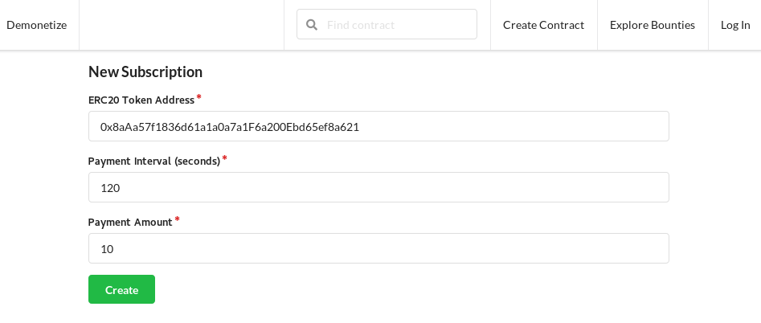
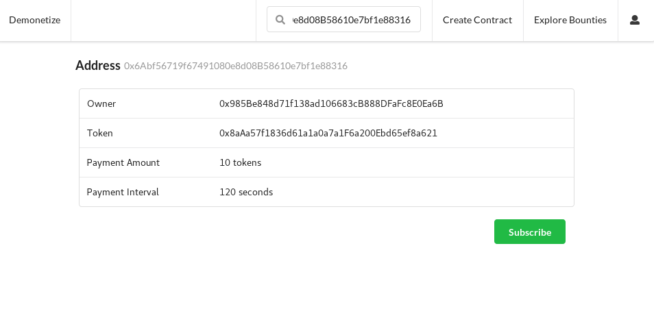
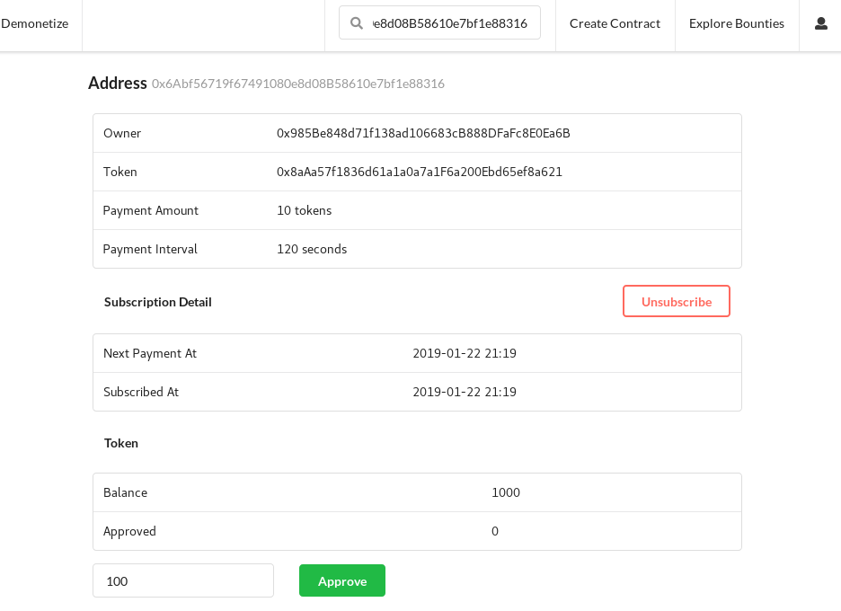
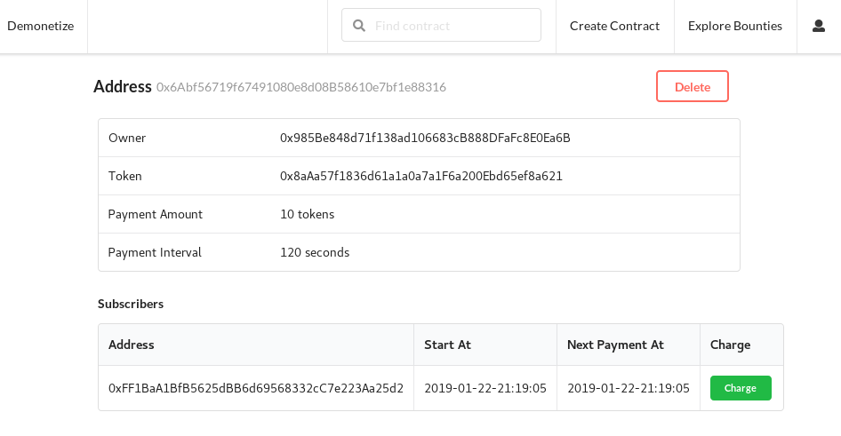
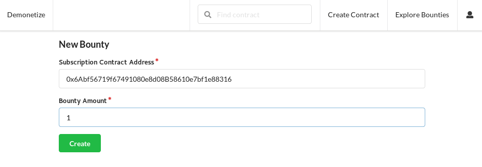
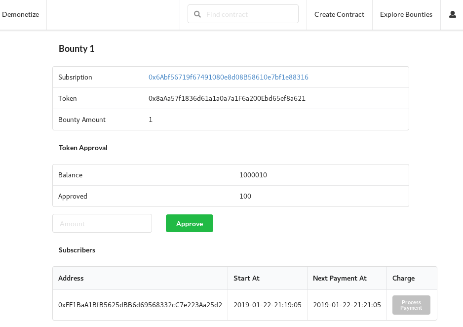

# demonitize
Demonetize is a decentralized application for managing recurring payments of ERC20 token.

### User Stories

##### Subscription Creator
An subscription creator creates a contract for recurring payment of a ERC20 token. He then shares this newly created contract address with his potential subscribers. After users have subscribed to this contract, the subscription creator can periodically charge them.

##### Subscriber
An user subscribes to a subscription contract. Next he approves the subscription contract to spend ERC20 token from his account. The subscription contract will only allow tokens to transfer periodically. Payments will be rejected if
the user disapproves this contract to transfer tokens or if the user unsubscribes from this contract.

##### Payment Processor
As a subscription creator, it can be time consuming to manually charge every subscriber. Therefore he has an option to register his contract for anyone to process his payments on his behalf. In exchange the payment processor receives a fee for his service.

## Development

Install dependencies
```shell
npm install
```

Start local blockchain
```shell
npm run chain
```

Deploy contracts
```shell
npm run compile
npm run migrate
```

Start client server
```shell
cd web-app
npm install
npm start
```

#### Account Setup for Development

- import accounts 1, 2, 3 from the private keys listed on ganache to MetaMask
  - account 1 will be the subscription creator
  - account 2 will be the subscriber
  - account 3 will be payment processor
- For each account, import the ERC20 token called `TestToken` into `MetaMask` so that token balance can be checked.
Contract address is listed on the migration log after `npm run migrate`

Accounts 1 and 2 are funded with some TestToken.

#### How to Creating a Subscription
Subscription Creator
- Create a subscription contract and share his contract address with users he wishes to correct recurring payments from.



Subscriber
- Takes the subscription contract address and subscribes to the contract.



Next he approves the contract to spend his tokens.



Subscription Creator
- He charges the subscriber. When the next payment time is reached, refresh the page to see the "Charge" button enabled again.



#### How to Setting up a Bounty
Subscription Creator
- Creates a bounty, listing his subscription contract address and a bounty amount rewarded to the payment processor.



#### How to Claim a Bounty
Payment Processor
- Finds a bounty and processes the payment. In exchange he receives some tokens.



## Testing
```shell
npm run chain
# in another terminal
npm test
```

##### Notes
Concat contracts for contract verification
```
npm run truffle-flattener -- contracts/Contract.sol
```
